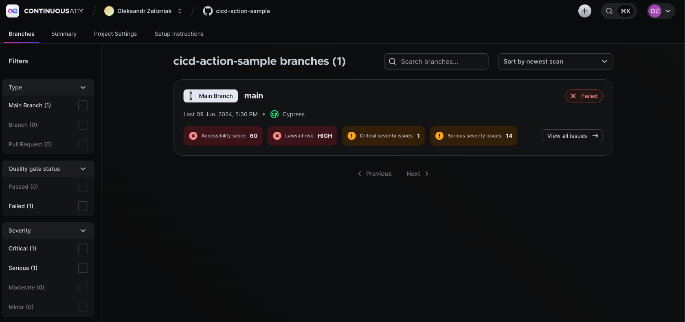

## Sample project of UserWay Continuous-Accessibility with GitHub Action.

This project uses the [UserWay Action](https://github.com/UserWayOrg/cicd-action) for GitHub workflows to trigger the Continuous-Accessibility analysis.

The GitHub Action is configured to build and analyze all branches and pull requests. See [this PR](https://github.com/UserWayOrg/cicd-action-sample/pull/2) as an example.

### Continuous-Accessibility Dashboard view

